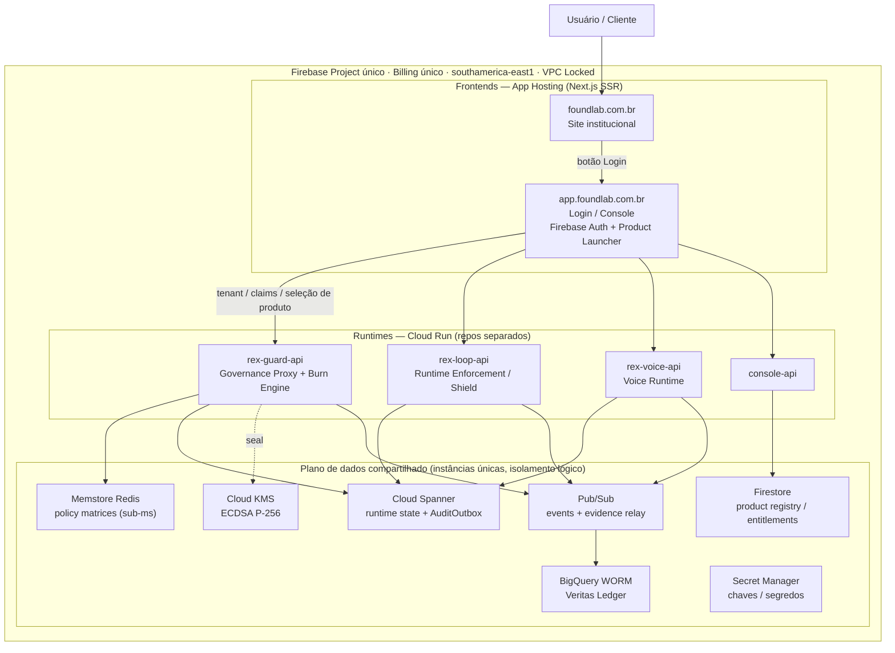
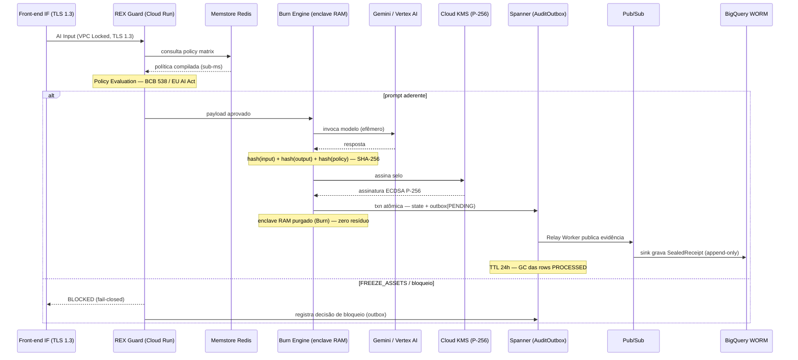
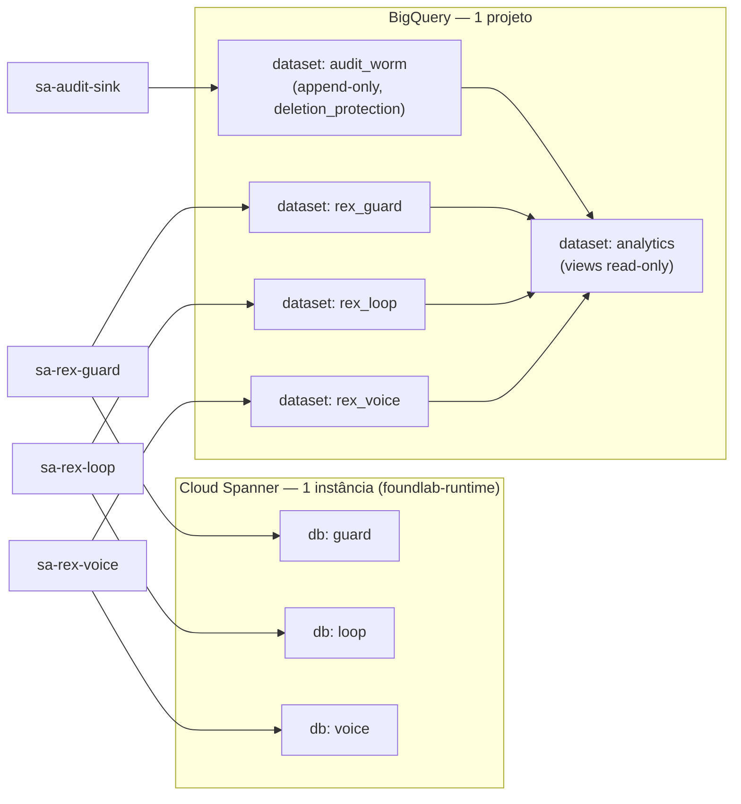
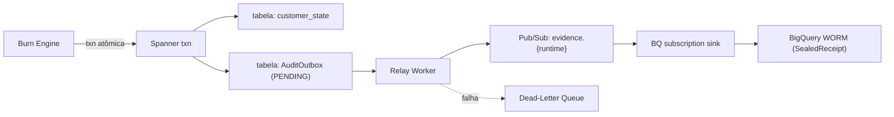
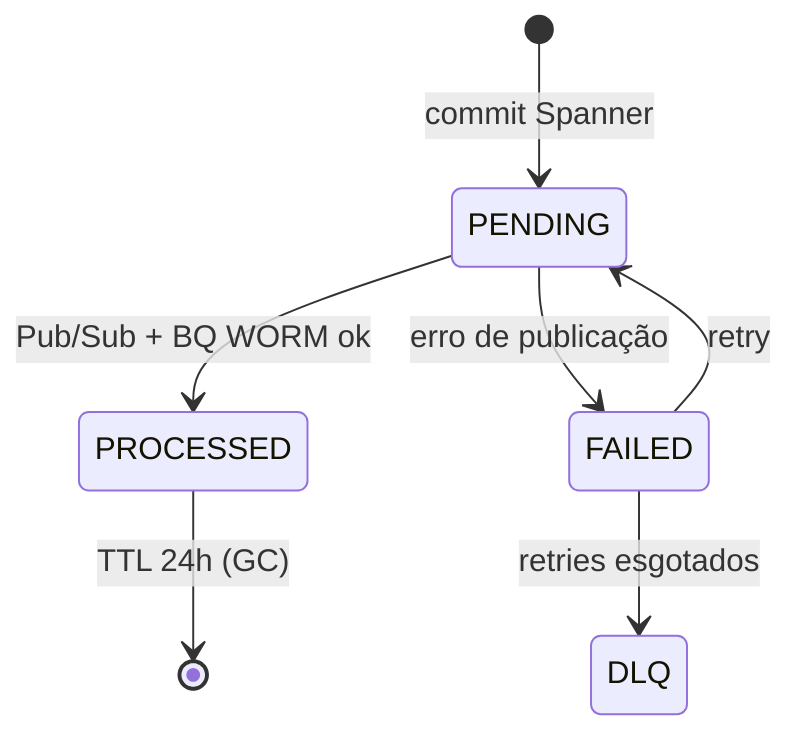

# FoundLab — Blueprint de Arquitetura Firebase-first (ATI)

**Status:** Baseline de arquitetura (target state) — pré-Terraform
**Região:** `southamerica-east1` (São Paulo)
**Escopo:** 1 Firebase Project · 1 Billing · superfície única, serviços modulares
**Doutrina:** *Compliance as Physics* · Zero-Persistence · runtimes não-integrados entre si
**Fonte de verdade:** “REX Guard e AuditOutbox: Arquitetura de Produção da ATI” (produção atual) + topologia Firebase-first (whiteboard)

-----

## 1. Princípios não-negociáveis

1. **Single project, single billing.** Tudo — frontends, runtimes, plano de dados — vive sob um Project ID e uma conta de billing (queima de créditos Nvidia Inception + Google, identidade unificada). Isolamento vem por **Service Account + namespace lógico + VPC-SC**, não por projetos separados.
1. **Runtimes não se integram entre si.** Não existe chamada `rex-guard-api → rex-voice-api`. Comunicação inter-runtime, quando necessária, é **exclusivamente via Pub/Sub**. Acoplamento direto = violação de doutrina.
1. **Repos separados, deploys independentes.** Cada frontend e cada runtime tem seu repositório e seu pipeline. Site institucional não conhece runtime; runtime não conhece site.
1. **Zero-Persistence.** Payload bruto e PII transitam apenas em RAM volátil no enclave do Burn Engine. Após o selo, a memória colapsa. Disco nunca vê dado sensível.
1. **Evidência ≠ dado.** O ledger guarda hashes + assinaturas (SealedReceipt), nunca o conteúdo. Auditor consulta prova matemática via SQL sem tocar o original.
1. **Frontends → App Hosting. Runtimes/APIs → Cloud Run.** Não misturar: App Hosting é para Next.js SSR (site, console); runtimes REX são serviços Cloud Run.

-----

## 2. Topologia de sistema



> **Regra de ouro:** as setas que entram em `Pub/Sub` e `Spanner` são por-runtime e isoladas por SA. Não há aresta runtime→runtime. Se aparecer uma, a doutrina quebrou.

-----

## 3. Fluxo end-to-end (Zero-Persistence Pipeline)

Cinco estágios determinísticos, idênticos ao pipeline de produção, generalizados para os 3 runtimes.



Estados de decisão (taxonomia rígida): `APPROVED` · `FREEZE_ASSETS` · `BLOCKED`. Cada SealedReceipt carrega `decision_id`, `timestamp`, validações (`OPIN consent`, `OFAC list`), `confidence_score` e a assinatura P-256.

-----

## 4. Plano de dados — compartilhado e organizado

Princípio: **uma instância física por serviço (paga/operada uma vez) + isolamento lógico por runtime + IAM por SA.**



|Serviço           |Instância             |Isolamento lógico                                     |Modelo de custo                    |
|------------------|----------------------|------------------------------------------------------|-----------------------------------|
|**Cloud Spanner** |1 instância regional  |1 **database** por runtime (`guard`/`loop`/`voice`)   |paga 1 instância (processing units)|
|**BigQuery**      |1 projeto (serverless)|1 **dataset** por runtime + `audit_worm` + `analytics`|storage + query                    |
|**Firestore**     |multi-database        |`console` (registry/entitlements) + `*-db` por runtime|por uso                            |
|**Memstore Redis**|1 instância           |keyspaces por runtime (`guard:`/`loop:`/`voice:`)     |por instância                      |
|**Pub/Sub**       |compartilhado         |tópicos por domínio; sem assinatura cruzada           |por mensagem                       |
|**Secret Manager**|compartilhado         |prefixo por dono (`guard_*` etc.)                     |por segredo                        |
|**Cloud KMS**     |1 keyring             |chave de assinatura por runtime; ECDSA P-256          |por operação                       |

**Spanner com DB-por-runtime** é o que mata o custo (uma instância, não três) sem acoplar. **BigQuery `analytics`** é o único ponto de leitura cross-runtime — read-only, para o Console do Auditor. Isso é relatório, não integração.

-----

## 5. AuditOutbox — write-path de evidência

Padrão Outbox transacional no Spanner resolve o dual-write; o Relay desacopla a auditoria do caminho crítico.



Máquina de estados da row:



### Schema de referência (Spanner DDL)

```sql
CREATE TABLE AuditOutbox (
  outbox_id     STRING(36) NOT NULL,   -- UUID v4: distribui escrita, evita hotspotting
  partition_id  INT64 NOT NULL,
  payload       JSON NOT NULL,         -- SealedReceipt: decision_id, hashes, signature, confidence_score
  status        STRING(16) NOT NULL,   -- PENDING | PROCESSED | FAILED
  created_at    TIMESTAMP NOT NULL OPTIONS (allow_commit_timestamp = true),
  processed_at  TIMESTAMP,
) PRIMARY KEY (outbox_id),
  ROW DELETION POLICY (OLDER_THAN(processed_at, INTERVAL 1 DAY));
```

### SealedReceipt (payload — formato canônico)

```json
{
  "decision_id": "dc196cfe-...",
  "runtime": "rex-guard",
  "timestamp": "2026-06-13T14:32:00Z",
  "policy_hash": "sha256:...",
  "input_hash": "sha256:...",
  "output_hash": "sha256:...",
  "prev_hash": "sha256:...",
  "controls": { "opin_consent": "PASS", "ofac": "PASS" },
  "burn_engine_status": "APPROVED",
  "confidence_score": 0.10395899,
  "signature": "ecdsa_p256:..."
}
```

> **Merkle por-runtime, não global.** `prev_hash` encadeia dentro do stream do próprio runtime. Cadeia global única acoplaria os runtimes por ordenação — proibido. A consolidação acontece só na leitura, em `analytics`.

-----

## 6. Matriz IAM (Service Account × recurso)

Least privilege: cada SA toca **apenas** o seu namespace. A ausência de permissão cruzada *é* o isolamento.

|Service Account|Spanner        |BigQuery                  |Firestore      |Secret Mgr        |Pub/Sub             |KMS             |
|---------------|---------------|--------------------------|---------------|------------------|--------------------|----------------|
|`sa-rex-guard` |db `guard` (RW)|dataset `rex_guard` (RW)  |`guard-db` (RW)|`guard_*` (access)|pub `evidence.guard`|sign key `guard`|
|`sa-rex-loop`  |db `loop` (RW) |dataset `rex_loop` (RW)   |`loop-db` (RW) |`loop_*` (access) |pub `evidence.loop` |sign key `loop` |
|`sa-rex-voice` |db `voice` (RW)|dataset `rex_voice` (RW)  |`voice-db` (RW)|`voice_*` (access)|pub `evidence.voice`|sign key `voice`|
|`sa-console`   |—              |dataset `analytics` (read)|`console` (RW) |`console_*`       |—                   |—               |
|`sa-audit-sink`|—              |`audit_worm` (append-only)|—              |—                 |sub `evidence.*`    |verify only     |

Regras duras:

- Nenhuma SA de runtime tem acesso ao db/dataset de outro runtime.
- `sa-audit-sink` é a **única** com escrita no `audit_worm` — caminho de escrita único = imutabilidade forte.
- VPC Service Controls perímetro envolvendo Spanner/BigQuery/Secret Manager; tráfego runtime↔dados nunca sai do perímetro.

-----

## 7. Deploy & domínios

|Componente        |Produto                              |Repo               |Deploy               |Domínio                 |
|------------------|-------------------------------------|-------------------|---------------------|------------------------|
|Site institucional|App Hosting (Next.js SSR)            |`foundlab-umbrella`|push `main` → rollout|`foundlab.com.br` (apex)|
|Login / Console   |App Hosting (Next.js + Firebase Auth)|`foundlab-console` |push `main` → rollout|`app.foundlab.com.br`   |
|`console-api`     |Cloud Run                            |`console-api`      |CI → deploy          |interno                 |
|`rex-guard-api`   |Cloud Run                            |`rex-guard`        |CI → deploy          |interno / VPC           |
|`rex-loop-api`    |Cloud Run                            |`rex-loop`         |CI → deploy          |interno / VPC           |
|`rex-voice-api`   |Cloud Run                            |`rex-voice`        |CI → deploy          |interno / VPC           |

- **VPC Locked:** runtimes não expõem ingress público; só o Console (autenticado) os invoca via conector serverless VPC.
- **TLS 1.3** ponta a ponta; mTLS interno Console↔runtime opcional (recomendado).
- App Hosting provisiona SSL e CDN automaticamente para os frontends.

-----

## 8. Mapeamento regulatório

|Norma                         |Exigência                                                     |Mecanismo no blueprint                                            |
|------------------------------|--------------------------------------------------------------|------------------------------------------------------------------|
|**BCB 538/2025**              |controles técnicos comprováveis, rastreabilidade, criptografia|REX Guard fail-closed + Veritas Ledger (BigQuery WORM) + KMS P-256|
|**CMN 5.274/2025**            |controle sobre sistemas de terceiros, testes independentes    |VPC Locked + exfiltração zero + audit trail SQL                   |
|**BCB 498**                   |credenciamento PSTI / RSFN                                    |isolamento de rede + atestação por decisão                        |
|**LGPD Art. 15/16**           |eliminação de PII pós-finalidade                              |Zero-Persistence (enclave RAM) + crypto-shred                     |
|**EU AI Act / DORA / SR 11-7**|logs anti-adulteração, explicabilidade                        |SealedReceipt + Merkle por-runtime + WORM append-only             |

-----

## 9. Decisões abertas & riscos (resolver antes do Terraform)

1. **CG-003 — crypto-shred ainda simulado.** O `destroyCryptoKeyVersion` do Cloud KMS tem janela mínima obrigatória de ≥24h; a linguagem “eliminado imediatamente” é juridicamente indefensável enquanto o shred for `shredBuffer` em memória. Decidir: aceitar a janela KMS e ajustar o claim, ou implementar destruição de chave efêmera por-decisão.
1. **Custo Spanner.** Mesmo com 1 instância, o piso regional não escala a zero. Validar se `audit_worm` (BigQuery) já cobre o papel de evidência imutável e o Spanner fica só com estado quente + ordenação — evitando pagar dois ledgers.
1. **Isolamento single-project.** Billing/identidade unificados ganham créditos e simplicidade, mas o blast radius é único. Mínimo aceitável: VPC-SC + SA sem permissão cruzada (seção 6). Reavaliar projeto-por-ambiente quando entrar dado de cliente real.
1. **Console como ponto único de autorização.** Tenant/claims vivem no Firestore `console` e viram custom claims no token Firebase Auth; runtimes verificam claims. Se um runtime aceitar request sem validar claim, o launcher vira decorativo.
1. **`NEXT_PUBLIC_CONSOLE_URL`.** O site institucional precisa do botão Login apontando para `app.foundlab.com.br` via env — cravar o subdomínio antes de fechar a migração do site.

-----

## 10. Próximo passo de provisionamento

Ordem sugerida para virar Terraform (módulos):

1. `00-project` — APIs, billing, VPC + VPC-SC perímetro.
1. `10-data` — Spanner (instância + 3 DBs), BigQuery (5 datasets), Firestore (multi-db), Memstore, KMS keyring.
1. `20-iam` — 5 SAs + bindings da matriz da seção 6.
1. `30-messaging` — tópicos `evidence.*`, BQ subscription sink, DLQ.
1. `40-runtimes` — Cloud Run (4 serviços) + conectores VPC.
1. `50-frontends` — App Hosting backends (site + console) + custom domains.

Cada módulo é `terraform plan` isolado; nada de state monolítico.