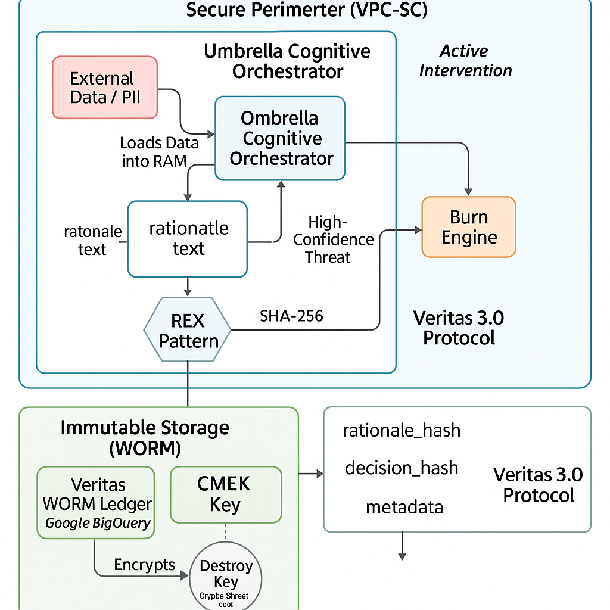

# F2F-RAaT: From Fact to Feedback
### A Reputation-as-a-Transaction Execution Engine by FoundLab

[](https://github.com/foundlab/f2f-raat-spec)
[](VERSION)
[](LICENSE)

---

**F2F-RAaT is a deterministic, non-oracular reputational execution engine designed for regulated, high-risk environments.**

It transforms objective, factual events into executable, economically-binding decisions without statistical inference, predictive models, or data exposure. It provides a cryptographically verifiable and fully auditable framework for turning reputation into a transactional mechanism.

This repository contains the **official specification**, **execution contract**, **invariants**, **audit structures**, and **cryptographic commitments** that define the F2F-RAaT Framework.

## 🏛️ Key Principles

- **Deterministic:** The same inputs always produce the same outputs. Every decision is reproducible.
- **Auditable & Verifiable:** Every action generates an immutable, cryptographic proof (`Veritas Proof`), creating a transparent and tamper-proof audit trail.
- **PII-Free by Design:** The core data structure, the `State Capsule`, carries reputational state without ever containing Personally Identifiable Information (PII).
- **Economically Binding:** Decisions can trigger real-world, policy-defined economic effects in a secure and pre-committed manner.

## 🏗️ The ATI Architecture at a Glance

<p align="center">
  
</p>

*For a deeper dive into the architecture, see the [F2F-RAaT Whitepaper](WHITEPAPER/F2F-RAAT_WHITEPAPER_v1.md).*

## 📘 Core Components

The framework is modular, with each component governing a specific part of the cycle:

- **[WHITEPAPER/](WHITEPAPER/)**: The conceptual, mathematical, and architectural blueprint.
- **[EXECUTION_CONTRACT/](EXECUTION_CONTRACT/)**: Formal constraints on what the runtime MUST and MUST NOT do.
- **[SPEZZATURA/](SPEZZATURA/)**: The T² deterministic reputation model specification.
- **[STATE_CAPSULE/](STATE_CAPSULE/)**: The PII-free, cryptographically-verifiable boundary object.
- **[BURN_ENGINE/](BURN_ENGINE/)**: The engine for deterministic authorization and economically binding actions.
- **[VERITAS/](VERITAS/)**: The specification for the immutable audit trail and cryptographic commitments.
- **[THREAT_MODEL/](THREAT_MODEL/)**: An analysis of adversarial vectors and their mitigations.
- **[GOVERNANCE/](GOVERNANCE/)**: Rules for policy signing, break-glass protocols, and override facts.

## 📦 Versioning

The specification follows Semantic Versioning (`MAJOR.MINOR.PATCH`).
- **MAJOR**: Breaking changes to invariants or the `State Capsule` format.
- **MINOR**: Additive, backwards-compatible extensions.
- **PATCH**: Formal clarifications, improved diagrams, or additional test vectors.

Current version: **1.0.0**

## 🔐 License

This work is licensed under the **Creative Commons Attribution-NonCommercial-NoDerivatives 4.0 International License**. See the [LICENSE](LICENSE) file for details.

This means you are free to share and redistribute the material for non-commercial purposes, but you must give appropriate credit and may not distribute modified versions.

## 📜 Citation

When referencing this specification, please use the following format:

```
FoundLab — F2F-RAaT: From Fact to Feedback. 
Reputational Execution Engine Specification v1.0. (2025)
https://github.com/foundlab/f2f-raat-spec
```
