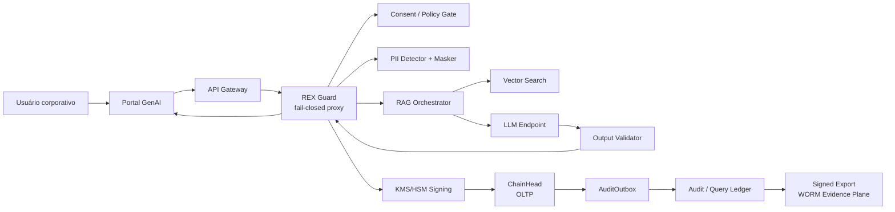
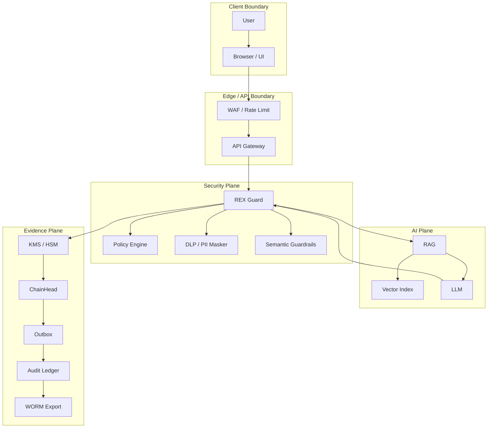
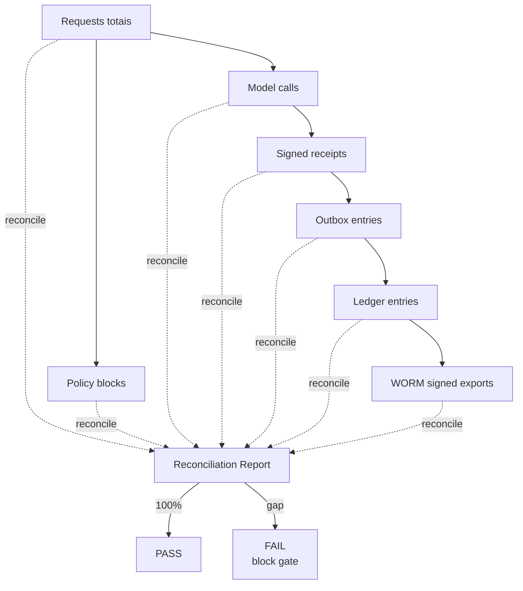
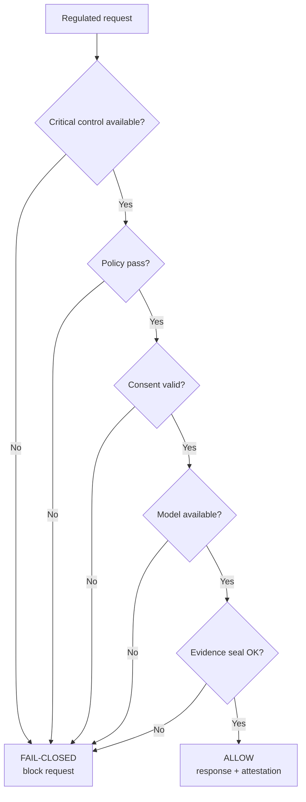
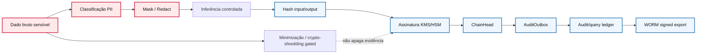
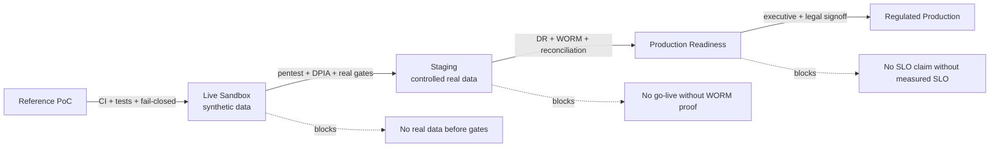

# SAD Público — Arquitetura de Referência para Plataforma GenAI Corporativa Regulada

**Versão pública:** v1.0.0 — Sanitized GitHub Edition  
**Base técnica:** arquitetura de referência ATI / REX Guard  
**Classificação:** PÚBLICO — SANITIZADO  
**Escopo:** arquitetura, controles, fluxos, ADRs e gates de evidência para GenAI em ambiente regulado  
**Autor técnico:** FoundLab — Auditable Trust Infrastructure  

> Este documento é uma versão pública e sanitizada de uma baseline arquitetural para plataformas GenAI corporativas em instituições reguladas.  
> Não representa ambiente produtivo de cliente específico, não declara relação comercial, não contém URLs internas, identificadores de projeto, nomes de contraparte, valores granulares de billing, commits, credenciais, evidências privadas ou dados operacionais sensíveis.

---

## Índice

- [Nota de Publicação](#nota-de-publicação)
- [Reviewer Fast Path](#reviewer-fast-path)
- [0. Tese](#0-tese)
- [1. Sumário Executivo](#1-sumário-executivo)
- [2. Arquitetura de Referência](#2-arquitetura-de-referência)
- [3. Arquitetura de IA e LLMOps](#3-arquitetura-de-ia-e-llmops)
- [4. Segurança Zero Trust e REX Guard](#4-segurança-zero-trust-e-rex-guard)
- [5. Governança, Conformidade e Privacidade](#5-governança-conformidade-e-privacidade)
- [6. ADRs](#6-adrs)
- [7. Stack Tecnológico de Referência](#7-stack-tecnológico-de-referência)
- [8. Justificativa Arquitetural](#8-justificativa-arquitetural)
- [9. Benchmarks e Evidências](#9-benchmarks-e-evidências)
- [10. Roadmap de Maturidade](#10-roadmap-de-maturidade)
- [11. Risk Register Público](#11-risk-register-público)
- [12. Linguagem Proibida](#12-linguagem-proibida)
- [Apêndice A — Mermaid](#apêndice-a--mermaid)

---

## Nota de Publicação

Esta edição foi preparada para GitHub público. O objetivo é demonstrar arquitetura, raciocínio técnico e disciplina de evidência sem expor informação sensível.

### Removido ou generalizado nesta versão

| Categoria | Tratamento público |
|---|---|
| Nome de cliente / contraparte | Generalizado para “instituição regulada” ou “cliente Tier‑1” |
| URLs, projetos cloud, ambientes e domínios | Removidos |
| Commits, branches e IDs internos | Removidos |
| Nomes próprios de stakeholders externos | Removidos |
| Valores granulares de billing | Substituídos por bandas e drivers de custo |
| Datas de validade de credenciais | Removidas |
| Evidências privadas de pipeline, DD ou procurement | Generalizadas como classes de evidência |
| Claims de produção regulada | Rebaixados para desenho, PoC, sandbox ou gate explícito |

### Contrato de leitura

Este SAD público é uma **arquitetura de referência**, não uma declaração de produção.  
Todo claim operacional deve ser lido em uma destas categorias:

- **Implemented**: já existe em implementação de referência ou PoC.
- **Designed / Gated**: desenho arquitetural definido, mas dependente de evidência ou integração.
- **Production Gate**: bloqueador formal antes de tráfego regulado real.
- **Out of Scope**: parte de stacks ATI paralelas, não descritas aqui.

Se um claim não aponta para evidência, gate ou dependência, ele é dívida de diligence. E dívida de diligence sempre cobra juros na pior reunião possível.

---

## Reviewer Fast Path

| Perfil | Leia primeiro | Pergunta que precisa responder |
|---|---|---|
| CISO / AppSec | [4](#4-segurança-zero-trust-e-rex-guard), [9](#9-benchmarks-e-evidências), [11](#11-risk-register-público) | Existe bypass? O fail-closed é real? Há vazamento de PII em logs? |
| DPO / Jurídico | [0](#0-tese), [5](#5-governança-conformidade-e-privacidade), [12](#12-linguagem-proibida) | O documento exagera claims legais? O crypto-shredding está qualificado? |
| Arquitetura Cloud | [2](#2-arquitetura-de-referência), [6](#6-adrs), [7](#7-stack-tecnológico-de-referência) | A topologia separa hot path, audit path e evidence plane? |
| Auditoria | [5.2](#52-audit-trail-e-modelo-de-commit), [9](#9-benchmarks-e-evidências), [A.3](#a3-fluxo-de-completude-de-evidência) | Há prova de integridade e completude? |
| SRE | [4.2](#42-failure-mode), [9](#9-benchmarks-e-evidências), [10](#10-roadmap-de-maturidade) | RTO/RPO/SLO são medidos ou só decorativos? |
| FinOps | [8.5](#85-finops), [7](#7-stack-tecnológico-de-referência) | O custo cresce por inferência ou por complexidade de compliance? |
| LLMOps / MRM | [3](#3-arquitetura-de-ia-e-llmops), [6.5](#65-adr-05--router-governado) | Router, prompts e modelos são governados? |

---

## Status executivo por propriedade

| Propriedade | Status público | Evidência exigida antes de produção |
|---|---|---|
| Fail-closed em rotas reguladas | Designed / Implemented em referência | Teste adversarial, chaos test, matriz de failure modes |
| PII minimization | Designed | Testes DLP/NER, redaction tests, DPIA |
| Zero-Persistence | Best-effort no runtime comum | Prova de ausência de persistência, log redaction, TEE se exigido |
| Evidence integrity | Designed / Implemented em referência | Vetores de assinatura, ChainHead proof, auditor query pack |
| Evidence completeness | Gated | Reconciliation report 100% por janela temporal |
| WORM evidence plane | Production Gate | Bucket Lock / retention lock / deny tests / signed exports |
| TSA externa RFC 3161 | Production Gate | Integração contratual e verificação de cadeia |
| OFAC / sanctions real | Staging Gate | Provider/API real, SLA e atualização de listas |
| LLM injection detection real | Staging Gate | Detector LLM-based, corpus adversarial e métrica de recall |
| DR e SLO | Gated | DR drill cronometrado e load test P50/P95/P99 |

---

## 0. Tese

### 0.1 O Paradoxo da Retenção

Instituições reguladas precisam preservar rastreabilidade, governança, auditoria e evidências suficientes para reconstituir decisões críticas. Ao mesmo tempo, normas de privacidade e proteção de dados impõem minimização, finalidade, necessidade, retenção limitada e direitos dos titulares.

Esse conflito é o **Retention Paradox**: reter tudo aumenta passivo de privacidade; apagar tudo compromete capacidade probatória.

A resposta arquitetural não é “guardar tudo com mais criptografia” nem “apagar tudo e torcer”. A resposta é separar:

- **Dado bruto sensível**, que deve ser minimizado, mascarado, expurgado ou inutilizado quando juridicamente possível.
- **Evidência verificável da decisão**, que deve permanecer auditável, assinada, encadeada e consultável.

### 0.2 Auditable Trust Infrastructure — ATI

**Auditable Trust Infrastructure (ATI)** é uma camada de infraestrutura para confiança auditável em sistemas de IA regulados.

A tese é simples: confiança operacional não escala; evidência verificável escala.

ATI separa dado bruto de evidência criptográfica. Dentro do perímetro controlado, prompts, outputs e dados sensíveis não devem ser persistidos sem necessidade. Em paralelo, recibos assinados, hashes, policy snapshots, versões de modelo e trilhas de cadeia permitem auditoria sem recriar lagoas tóxicas de dados.

### 0.3 REX Guard

**REX Guard** é uma engrenagem de entrada da ATI. Opera como proxy fail-closed entre aplicações reguladas e modelos generativos.

Funções centrais:

- Validar consentimento e escopo.
- Sanitizar input.
- Detectar e mascarar PII.
- Aplicar guardrails semânticos.
- Bloquear rotas reguladas em falha de controle.
- Validar output.
- Emitir recibo auditável.
- Alimentar audit ledger e evidence plane.

---

## 1. Sumário Executivo

### 1.1 Decisão arquitetural

A plataforma GenAI regulada deve ser construída com três separações explícitas:

1. **Hot path de inferência**: precisa ser rápido, controlado e fail-closed.
2. **Audit/query ledger**: precisa ser consultável e reconciliável.
3. **Evidence WORM plane**: precisa ser imutável, exportado, assinado e verificável externamente.

Misturar os três em uma única camada é o jeito elegante de criar uma auditoria que parece bonita no diagrama e sangra na diligência.

### 1.2 Princípios não-negociáveis

| Princípio | Regra |
|---|---|
| Fail-closed | Erro em controle crítico bloqueia, não passa |
| No silent bypass | Nenhuma chamada regulada ignora REX Guard |
| Evidence honesty | Resposta declara o estado real do evidence plane |
| Data minimization | Dado bruto sensível não vira log, cache ou lake por acidente |
| Least privilege | Runtime, ledger writer, provisioner e auditor usam identidades separadas |
| Auditability | Toda decisão relevante é correlacionável por DecisionID |
| FinOps | Controle de compliance não pode explodir custo fixo desnecessário |

### 1.3 Claim/Evidence Register

| Claim público permitido | Categoria | Evidência exigida |
|---|---|---|
| “REX Guard opera fail-closed em rotas reguladas” | Implemented / gated by tests | Matriz de falha, teste de bypass, chaos test |
| “BigQuery é audit/query ledger” | Arquitetural | Dataset, schema, relay, queries |
| “Cloud Storage Bucket Lock é evidence plane WORM” | Production Gate | Retention lock, signed export, deny test |
| “Zero-Persistence é best-effort no runtime comum” | Qualificado | Prova de ausência de persistência + redaction |
| “Crypto-shredding inutiliza dado criptograficamente” | Gated | KMS destroy workflow + matriz legal |
| “TSA RFC 3161 externa reforça timestamp proof” | Production Gate | Integração TSA real e certificado validado |

---

## 2. Arquitetura de Referência

### 2.1 Camadas

| Camada | Responsabilidade | Componentes típicos |
|---|---|---|
| Apresentação | UI conversacional e attestation visual | Web app, design system, acessibilidade |
| API / Orquestração | Autenticação, rate limit, routing, policy enforcement | API Gateway, service mesh, REX Guard |
| IA / RAG | Retrieval, reranking, geração e validação | Vertex AI, vector search, reranker |
| Audit | Recibos, assinatura, hash-chain, outbox | KMS/HSM, Spanner, BigQuery |
| Evidence WORM | Export assinado e retenção bloqueada | Cloud Storage Bucket Lock ou equivalente |
| Observabilidade | Métricas, logs sanitizados, traces sem PII | SIEM, monitoring, alerting |

### 2.2 Estratégia de dados

| Tipo | Tecnologia de referência | Modelo de commit | Observação |
|---|---|---|---|
| OLTP / ChainHead | Cloud Spanner ou equivalente | Síncrono | Commit barrier antes da resposta |
| AuditOutbox | Cloud Spanner ou equivalente | Síncrono transacional | Durabilidade do recibo selado |
| Audit/query ledger | BigQuery ou equivalente | Assíncrono via relay | Consultabilidade e analytics |
| Evidence WORM | Object storage com retention lock | Assíncrono assinado | Imutabilidade probatória |
| Cache semântico | Redis/Memorystore | TTL PII-aware | PII direta proibida |
| Observabilidade | Logging/SIEM | Assíncrono, não probatório | Nunca fonte de verdade de auditoria |

### 2.3 Modelo de commit probatório

O contrato correto separa commit transacional, ledger consultável e evidência WORM.

```json
{
  "decision_id": "uuid-v4",
  "signature_status": "signed",
  "chain_status": "advanced",
  "outbox_status": "committed",
  "ledger_status": "pending_async",
  "ledger_sink": "bigquery_or_equivalent",
  "worm_export_status": "not_exported_yet",
  "commit_model": "spanner_sync_barrier__ledger_async_relay__worm_signed_export"
}
```

Estados possíveis:

| Campo | Estados válidos |
|---|---|
| `signature_status` | `signed`, `failed` |
| `chain_status` | `advanced`, `blocked`, `failed` |
| `outbox_status` | `committed`, `blocked`, `failed` |
| `ledger_status` | `pending_async`, `committed`, `failed`, `not_applicable` |
| `worm_export_status` | `not_exported_yet`, `exported`, `verified`, `failed`, `not_enabled` |

---

## 3. Arquitetura de IA e LLMOps

### 3.1 Pipeline RAG

Fluxo de referência:

1. Documento entra em storage controlado.
2. OCR/classificação extrai conteúdo.
3. PII scrubbing remove ou marca dados sensíveis.
4. Chunking semântico gera fragmentos versionados.
5. Embeddings são gerados.
6. Índice de serving atende baixa latência.
7. Índice analítico suporta auditoria e avaliação offline.
8. REX Guard valida query e output.
9. Resposta retorna citações, confidence score e evidence plane.

### 3.2 Governança de modelos

| Objeto governado | Requisito |
|---|---|
| Modelo generativo | Model card, owner, versão, limites e métricas |
| Modelo de embeddings | Versão, corpus, drift e benchmark de recall |
| Router Pro/Flash | Tratado como modelo governado |
| Prompt template | Versionado, assinado e auditável |
| Guardrail | Policy snapshot com hash |
| Reranker | Métrica de ganho e overhead medido |

### 3.3 Métricas mínimas

| Métrica | Por quê importa |
|---|---|
| Faithfulness | Reduz resposta não ancorada |
| Answer relevancy | Mede utilidade |
| Context precision / recall | Mede retrieval |
| Citation grounding | Permite auditoria |
| Misroute rate | Controla custo e qualidade |
| PII leak rate | Segurança e LGPD |
| Prompt injection recall | Segurança LLM |
| P95/P99 latency | UX e SLO |

---

## 4. Segurança Zero Trust e REX Guard

### 4.1 Módulos

| Módulo | Função | Maturidade pública |
|---|---|---|
| Input Sanitizer | Normalização, schema validation, prompt hygiene | Referência |
| Consent Gate | Validação de consentimento/escopo | Referência |
| PII Detector & Masker | DLP/NER, mascaramento e redaction | Referência / gated by tests |
| Intent Classifier | Classificação legítimo/suspeito/malicioso | Referência |
| Semantic Guardrail | Domínio autorizado e policy enforcement | Referência |
| Output Validator | PII residual, toxicidade, policy violation | Referência |
| OFAC / sanctions | Triagem de sanções | Staging Gate |
| BurnEngine / injection detector | Detector avançado de prompt injection | Staging Gate |
| Audit Logger | Recibo, assinatura e ChainHead | Referência |
| Rate Limiter | Controle de abuso | Referência |

### 4.2 Failure mode

Em rota regulada:

```text
controle indisponível = bloqueio
policy inválida = bloqueio
consentimento ausente = bloqueio
assinatura falhou = bloqueio
ChainHead falhou = bloqueio
AuditOutbox falhou = bloqueio
modelo indisponível = bloqueio
```

Bypass só pode existir para rota não regulada, sem dados sensíveis, com política formal e evidência de segregação. Bypass informal é só backdoor com crachá.

### 4.3 STRIDE para GenAI

| STRIDE | Ameaça GenAI | Controle |
|---|---|---|
| Spoofing | Usuário tenta assumir identidade ou escopo | MFA, session binding, ABAC |
| Tampering | RAG poisoning | Hash em ingestão, aprovação, lineage |
| Repudiation | Negação de decisão | DecisionID, assinatura, ChainHead |
| Information Disclosure | Vazamento de PII via prompt/output | Masking, output validation, no-PII logs |
| DoS | Prompt stuffing e exaustão de contexto | Rate limit, token budget |
| Elevation | Jailbreak para ação não permitida | Guardrails, action whitelist, HITL |

### 4.4 Zero-Persistence qualificado

Zero-Persistence nesta arquitetura significa:

- Não persistir intencionalmente prompt/output bruto sensível.
- Redigir logs e traces.
- Proibir PII direta em cache.
- Descartar buffers mutáveis quando possível.
- Usar TTLs agressivos para estado transitório.
- Usar TEE/Confidential Computing quando exigência contratual ou regulatória pedir garantia mais forte.

Não significa:

- Garantia física universal de zeroização de strings imutáveis em runtime gerenciado.
- Direito de eliminação automática sem matriz legal.
- Ausência de qualquer dado derivado.
- Apagamento mágico de evidência assinada.

---

## 5. Governança, Conformidade e Privacidade

### 5.1 Matriz regulatória pública

| Domínio | Controle arquitetural |
|---|---|
| LGPD — minimização | DLP, masking, cache policy, no-PII logs |
| LGPD — direitos do titular | DSR workflow, crypto-shredding gated, lineage |
| Segurança cibernética | Zero Trust, KMS/HSM, SIEM, WAF |
| Governança de IA | Model registry, model cards, prompt versioning |
| Auditabilidade | DecisionID, ChainHead, signature, ledger, evidence plane |
| Gestão de risco de modelo | Evaluation pack, drift policy, HITL |
| Continuidade | DR drill, restore test, RTO/RPO medidos |

### 5.2 Audit trail e modelo de commit

Cada evento relevante deve conter:

| Campo | Descrição |
|---|---|
| `decision_id` | UUID de correlação |
| `timestamp` | Timestamp confiável do commit barrier |
| `user_hash` | Hash com salt, sem PII direta |
| `session_id` | Identificador de sessão |
| `action_type` | Tipo de operação |
| `model_version` | Versão de modelo |
| `policy_snapshot_hash` | Hash da política ativa |
| `input_hash` | Hash do input sanitizado |
| `output_hash` | Hash do output validado |
| `previous_event_hash` | Encadeamento |
| `signature` | Assinatura ECDSA ou equivalente |
| `evidence_plane` | Status real do commit e exportação |

### 5.3 Crypto-shredding qualificado

Crypto-shredding é mecanismo técnico de inutilização criptográfica por destruição de material de chave.

Ele depende de:

- Envelope encryption bem desenhado.
- Chaves por classe de dado ou tenant quando aplicável.
- Procedimento formal de destroy.
- Janela operacional do provedor.
- Matriz legal por classe de dado.
- Evidência auditável da operação.

Crypto-shredding não deve ser vendido como “apagamento jurídico imediato”. Isso é overclaim, e overclaim em privacidade costuma virar esporte de contato.

---

## 6. ADRs

### 6.1 ADR-01 — Vector Search split

**Decisão:** separar índice de serving de baixa latência e índice analítico/batch.

**Motivo:** caminho crítico precisa de latência previsível; auditoria e analytics precisam de flexibilidade.

### 6.2 ADR-02 — REX Guard fail-closed

**Decisão:** toda rota regulada passa por REX Guard; falha de controle bloqueia.

**Consequência:** disponibilidade do REX Guard vira SLO próprio.

### 6.3 ADR-03 — Regionalidade e DR

**Decisão:** dados regulados permanecem em região aprovada; DR internacional exige gate jurídico.

**Consequência:** RTO/RPO só são claims válidos após drill.

### 6.4 ADR-04 — Evidence sealing

**Decisão:** recibos são assinados e encadeados antes do retorno quando a rota exige evidência.

**Consequência:** falha em assinatura ou ChainHead bloqueia resposta regulada.

### 6.5 ADR-05 — Router governado

**Decisão:** router de modelos é tratado como modelo governado.

**Consequência:** exige model card, métricas de misroute, override rate e drift.

### 6.6 ADR-06 — Audit commit model

**Decisão:** Spanner/equivalente é commit barrier síncrono; BigQuery/equivalente é audit/query ledger assíncrono; WORM externo é signed export.

**Consequência:** resposta deve declarar `ledger_status = pending_async` quando o ledger ainda não confirmou.

### 6.7 ADR-07 — Limitações de runtime

**Decisão:** Zero-Persistence em runtime gerenciado é best-effort, não garantia física universal.

**Consequência:** TEE vira perfil enterprise quando exigido.

### 6.8 ADR-08 — Cache TTL PII-aware

| Classe | Política |
|---|---|
| PII direta | Cache proibido |
| PII-risk normalizada | Hash-only ou TTL curto |
| Non-PII normalizada | Cache permitido com TTL controlado |
| Evidence metadata | Cache não autoritativo |

### 6.9 ADR-09 — Service accounts separados

| SA | Responsabilidade | Proibido |
|---|---|---|
| Runtime SA | Execução de request | Alterar WORM / provisioning |
| Ledger Writer SA | Escrever outbox/ledger | Processar payload |
| WORM Export SA | Export assinado | Executar runtime |
| Provisioner SA | Infra/IaC | Atender request |
| Auditor SA | Leitura verificadora | Mutação |

### 6.10 ADR-10 — TLS e transporte

**Baseline:** TLS 1.2+ obrigatório, TLS 1.3 preferido, weak ciphers desabilitados, mTLS interno quando aplicável.

### 6.11 ADR-11 — Evidence WORM storage contract

**Decisão:** audit/query ledger não é automaticamente WORM probatório. WORM-grade exige export assinado para storage com retention lock.

---

## 7. Stack Tecnológico de Referência

| Camada | Tecnologia exemplo | Alternativas |
|---|---|---|
| API Gateway | Apigee X | Kong, Envoy Gateway |
| Runtime | Cloud Run / GKE | ECS, AKS, Kubernetes |
| Service Mesh | Istio | Linkerd, Anthos Service Mesh |
| LLM | Vertex AI Gemini | Azure OpenAI, Bedrock, self-hosted |
| Vector serving | Vertex AI Vector Search | Pinecone, Weaviate, pgvector |
| Analytics | BigQuery | Snowflake, Databricks |
| OLTP / Chain | Spanner | CockroachDB, Yugabyte, Postgres serializado |
| KMS/HSM | Cloud KMS/HSM | AWS KMS/CloudHSM, Azure Key Vault HSM |
| WORM | Cloud Storage Bucket Lock | S3 Object Lock, immutable blob storage |
| SIEM | Chronicle | Splunk, Sentinel |
| IaC | Terraform | Pulumi, Crossplane |
| CI/CD | GitHub Actions / Cloud Build | GitLab CI, Tekton |

---

## 8. Justificativa Arquitetural

### 8.1 Por que outbox assíncrono

BigQuery ou ledger analítico síncrono no hot path adiciona latência e complexidade sem aumentar durabilidade se o recibo já foi selado e gravado em outbox transacional.

A decisão correta é:

```text
assinatura + ChainHead + outbox = commit barrier
BigQuery = consulta e analytics
WORM = prova externa por export assinado
```

### 8.2 Por que não prometer Zero-Persistence absoluto

Runtimes gerenciados como Node.js/V8, JVM ou Python não oferecem controle físico universal sobre memória imutável e garbage collector.

A promessa defensável é:

- sem persistência intencional;
- logs sanitizados;
- cache controlado;
- buffers sensíveis tratados com cuidado;
- TEE quando necessário.

### 8.3 Por que sanctions e injection detection são gates

Triagem de sanções real exige provider, contrato, SLA de atualização e testes. Detector robusto de prompt injection exige corpus adversarial, métricas e retreinamento.

Keyword gate serve para demonstrar fluxo. Não serve para produção regulada.

### 8.4 Por que TSA externa é gate

Timestamp externo RFC 3161 melhora independência probatória, mas depende de integração e cadeia de confiança. Mock de PoC valida shape do fluxo; produção exige TSA real.

### 8.5 FinOps

O custo da arquitetura deve escalar principalmente por:

- volume de tokens;
- volume de decisões;
- operações de assinatura;
- storage e retenção de evidência;
- queries analíticas.

O custo **não** deve escalar por replicar infraestrutura crítica sem motivo. Compliance bom é caro o suficiente; não precisa de criatividade para ficar pior.

---

## 9. Benchmarks e Evidências

### 9.1 Benchmarks obrigatórios

| Benchmark | Métrica |
|---|---|
| End-to-end latency | P50 / P95 / P99 |
| REX Guard overhead | delta com/sem proxy |
| Retrieval quality | Recall@5 / Recall@20 |
| Reranker overhead | ms por request |
| Prompt injection defense | recall / false positive |
| PII leakage | taxa de vazamento residual |
| Load test | throughput sustained |
| Outbox relay | lag, retries, DLQ |
| WORM export | tempo até export verified |
| DR drill | RTO / RPO medidos |
| Cost per decision | custo unitário completo |

### 9.2 Evidence pack mínimo

| Audiência | Evidência |
|---|---|
| CISO | pentest LLM, SBOM, SCA, IAM matrix, no-PII logging tests |
| DPO | DPIA, ROPA, DSR workflow, crypto-shredding legal matrix |
| Arquitetura | ADRs, network topology, service account topology, region evidence |
| Auditoria | DecisionID schema, signature proof, ChainHead proof, completeness report |
| SRE | runbooks, tabletop, DR drill, restore test, load test |
| FinOps | billing export, cost per decision, cost per token, CUD assumptions |
| LLMOps | model cards, prompt versioning, evaluation pack, drift policy |

### 9.3 Prova de completude

Integridade prova que um recibo não foi adulterado. Completude prova que nenhum recibo sumiu.

A prova mínima compara:

```text
total_requests
= total_policy_blocks
+ total_model_calls
= total_signed_receipts
+ total_blocked_without_receipt_when_applicable
= total_outbox_entries
= total_ledger_entries_after_relay
= total_worm_exports_after_window
```

Qualquer diferença precisa de reconciliação, DLQ ou incidente formal.

---

## 10. Roadmap de Maturidade

| Fase | Objetivo | Gate |
|---|---|---|
| Fase 0 — Reference PoC | Validar fail-closed, recibo, ChainHead e outbox | CI verde + testes de controle |
| Fase 1 — Live sandbox | Ambiente ativo com dados sintéticos | No-PII + attestation + logs sanitizados |
| Fase 2 — Staging real data | Dados reais controlados | Pentest, DPIA, OFAC real, BurnEngine real, TSA real |
| Fase 3 — Production readiness | SLO, DR, WORM, auditoria | DR drill, Bucket Lock, reconciliation 100% |
| Fase 4 — Regulated production | Operação contínua | SLO medido, auditor query pack, incident response |

---

## 11. Risk Register Público

| Risco | Severidade | Probabilidade | Mitigação | Gate |
|---|---:|---:|---|---|
| Overclaim de WORM | Alta | Média | Separar ledger consultável de WORM export | Produção |
| PII em logs/traces | Alta | Média | Redaction tests, OTel scrubber, crash dump policy | Staging |
| Bypass informal | Crítica | Baixa | Network policy, gateway enforcement, fail-closed tests | Staging |
| Prompt injection sofisticado | Alta | Média | Detector LLM-based, corpus adversarial, red team | Staging |
| Sanctions screening fraco | Alta | Média | Provider real e SLA de atualização | Staging |
| Ledger incompleto | Alta | Média | Outbox reconciliation e DLQ | Produção |
| DR fictício | Alta | Média | Drill cronometrado | Produção |
| Zero-Persistence mal interpretado | Média | Alta | Linguagem qualificada e TEE opcional | Sempre |
| Crypto-shredding tratado como erase absoluto | Alta | Média | Matriz legal e KMS lifecycle | Staging |
| Router degrada qualidade/custo | Média | Média | Model governance e misroute metrics | Staging |

---

## 12. Linguagem Proibida

Não usar em material público, comercial ou técnico sem evidência forte:

| Frase proibida | Substituir por |
|---|---|
| “BigQuery é WORM” | “BigQuery é audit/query ledger; WORM exige export assinado com retention lock” |
| “Zero-Persistence garante zeroização física” | “Zero-Persistence é best-effort no runtime atual; TEE é perfil enterprise” |
| “Crypto-shredding apaga legalmente de imediato” | “Crypto-shredding inutiliza criptograficamente, sujeito a matriz legal e lifecycle de chave” |
| “Sandbox live é produção” | “Live sandbox processa synthetic data e não constitui produção regulada” |
| “Compliance matemático resolve LGPD” | “Evidência criptográfica reduz risco e melhora auditabilidade; jurídico valida aplicação” |
| “Prompt injection resolvido” | “Prompt injection mitigado por camadas e sujeito a red team contínuo” |
| “Auditável 100%” | “Auditável conforme evidence pack e reconciliation report” |

---

## Apêndice A — Mermaid

### A.1 Contexto C4 Simplificado



### A.2 Trust Boundaries



### A.3 Fluxo de Completude de Evidência



### A.4 Failure Mode Matrix



### A.5 PII Lifecycle / Evidence Split



### A.6 Environment Promotion Gates



---

## Licença e uso

Este documento pode ser usado como referência técnica pública, desde que preservadas as qualificações de maturidade, gates e linguagem proibida. Remover os gates e manter os claims é transformar arquitetura em fanfic. Não faça isso.

---

**FoundLab — Auditable Trust Infrastructure**  
*Programmable Trust Layer · Trust by Evidence*  
*Don’t trust. Verify.*