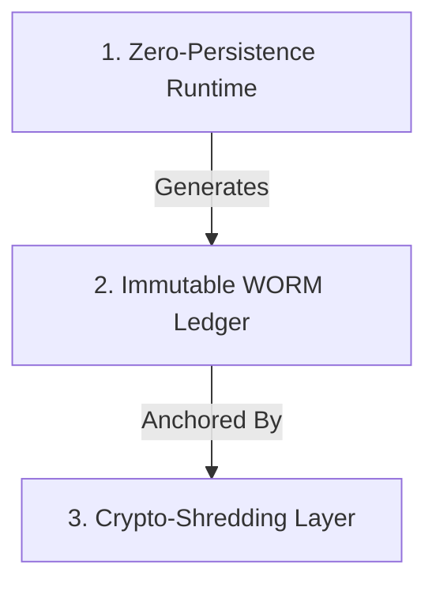

# Auditable Trust Infrastructure (ATI)
> **"Solving the conflict between Privacy and Proof."**

The **ATI** is the overarching architectural standard that governs how AI, Data, and Trust interact in regulated industries. It provides the environment in which engines like **F2F-RAaT** operate.

It was designed to solve the **"Regulatory Paradox"**:
*The law requires you to **know your customer** (KYC/AML) forever.*
*The law requires you to **forget their data** (GDPR/LGPD) immediately.*

**How do you prove you made the right decision if you deleted the data?**

---

## 🏛️ The Three Pillars of Trust by Physics

The ATI replaces policy-based trust ("we promise not to look") with physics-based trust ("we cannot look").

### 1. Zero-Persistence Runtime
Data exists in memory **only** for the milliseconds required to compute a decision. The runtime has no disk write access. Once the transaction closes, the data evaporates.
* **Component**: `F2F-RAaT Burn Engine`

### 2. Immutable WORM Ledger
Instead of storing data, we store **Proofs**. A Write-Once-Read-Many ledger records the cryptographic hash of every decision, logic path, and outcome.
* **Component**: `Veritas Protocol`

### 3. Crypto-Shredding
When a user asks to be "forgotten", we do not scrub disks. We simply **delete the encryption key** for their specific records in the archive. The data remains, but is mathematically unrecoverable (entropy).
* **Component**: `Key Management System (KMS)`

---

## 🧠 Cognitive Auditability (Veritas 3.0)

Traditional AI explains itself with "Confidence: 94%".
ATI AI explains itself with **Causal Rationale**.

We introduce the concept of **Rationale Hashing**:
1. AI makes a decision.
2. AI generates a text rationale ("Blocked because velocity > 500").
3. This rationale is hashed and signed on the WORM ledger.
4. **Result**: You can mathematically prove *what the AI was thinking* at the moment of decision, without saving the raw data it looked at.

---

## 📚 The Narrative Journey

Start here to understand the philosophy before the code:

1.  **[The Regulatory Paradox](./01_THE_REGULATORY_PARADOX.md)**
    *   *The Problem*: Why banks are trapped between retention and erasure.
2.  **[The Three Pillars](./02_TRUST_BY_PHYSICS_PILLARS.md)**
    *   *The Solution*: How we use physics to solve law.
3.  **[Cognitive Auditability](./03_COGNITIVE_AUDITABILITY_AI.md)**
    *   *The Brain*: Taming Generative AI with deterministic proofs.
4.  **[Strategic Impact](./04_STRATEGIC_IMPACT.md)**
    *   *The Value*: How compliance becomes a competitive weapon ("Operational Alpha").

---

[⬅️ Back to F2F-RAaT Spec](../README.md)
