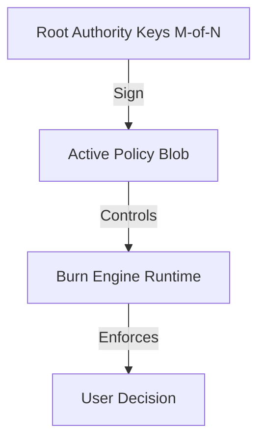

# Governance & Control
> **"Who watches the watchers? Math watches everyone."**

In a decentralized or automated system, Governance is the most critical attack vector. If an attacker controls the Policy, they control the Truth.

This directory defines the **Cryptographic Governance Layer** that secures the F2F-RAaT runtime against internal corruption and unauthorized changes.

---

## 🔐 The "Code is Law" Hierarchy

We enforce governance through **Multi-Sig Cryptography**, not just PDF guidelines.

### 1. Policy Signing
The engine **refuses to boot** unless the loaded Policy file has a valid digital signature from the quorum of administrators.
*   **[Policy Signing Spec](policy_signing.md)**

### 2. Override Facts (The "Veto")
Sometimes reality changes faster than code. An `OverrideFact` allows a human authority to inject a forceful truth (e.g., "This user is Safe") into the engine.
This is not a database edit. It is a signed transaction that becomes part of the audit trail.
*   **[Override Fact Spec](override_fact.md)**

### 3. Break-Glass Protocol
In case of catastrophic AI failure (e.g., blocking all users), we have a kinetic, physical protocol to bypass the engine.
*   **[Break-Glass Protocol](break_glass_protocol.md)**

---

## 🛡️ Principles

*   **No Silent Edits**: Every administrative action leaves a hash on the Veritas Ledger.
*   **No Single Point of Failure**: Critical changes require M-of-N consensus.
*   **Time-Lock**: Major policy shifts have a mandatory delay before activation.

---

[⬅️ Back to Main Spec](../README.md)
