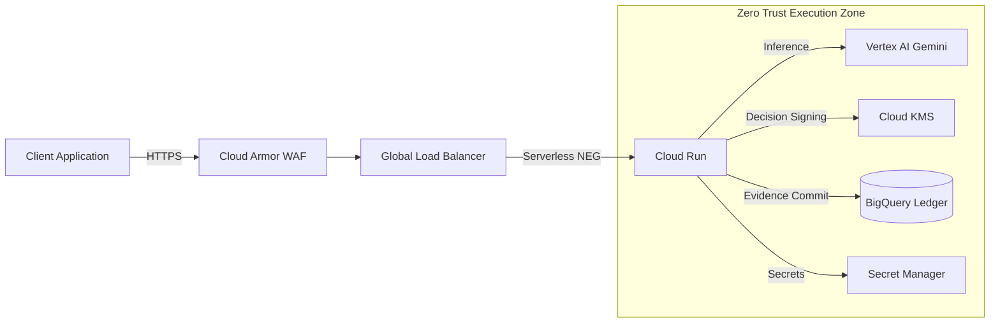

<div align="center">
  
</div>

<div align="center">

# REX Gemini Guard  
### Cryptographic Governance Layer for Vertex AI (Gemini)

[](LICENSE.txt)
[](ARCHITECTURE_STATUS.md)
[](SECURITY.md)


**FoundLab · Alex Luiz Bolson**  
alexbolson@foundlab.com.br · February 2026

</div>

---

## Table of Contents

- [Overview](#overview)
- [Key Capabilities](#key-capabilities)
- [Architecture](#architecture)
- [Security & Compliance](#security--compliance)
- [Deployment](#deployment)
  - [Prerequisites](#prerequisites)
  - [Provision Infrastructure](#provision-infrastructure)
  - [Build & Push the Container](#build--push-the-container)
  - [Verify](#verify)
- [Post-Deployment Verification](#post-deployment-verification)
- [Repository Layout](#repository-layout)
- [Performance](#performance)
- [Roadmap](#roadmap)
- [Security Notes](#security-notes)
- [Contributing](#contributing)
- [License](#license)

---

## Overview

**REX Gemini Guard** is a cryptographic governance middleware for generative AI.

It sits between applications and **Google Vertex AI (Gemini)**, enforcing governance policies and producing **verifiable execution evidence** for every AI decision.

You get:

- deterministic policy enforcement (fail-closed)
- cryptographic decision signing
- immutable audit evidence
- a *zero-persistence* proxy architecture

This enables **provable AI governance** for regulated environments.

> [!NOTE]
> This project is designed as an infra-grade component: auditability, integrity, and deterministic behavior are prioritized over convenience.

---

## Key Capabilities

### Zero-Persistence Architecture
Stateless proxy design. No user data persists at rest.

### Cryptographic Decision Proof
Every AI interaction is signed using **Cloud KMS (ECDSA P-256)**.

### Immutable Evidence Ledger
Audit evidence is written to **BigQuery append-only tables (WORM)**.

### Governance-as-Code
Policies are evaluated **before** requests reach the LLM.

---

## Architecture

Reference architecture for production deployment.




---

## Security & Compliance

| Feature | Implementation | Guarantee |
|---|---|---|
| Zero Persistence | Stateless proxy + ephemeral filesystem | No prompt/response retention |
| Cryptographic Integrity | Cloud KMS ECDSA signing | Decisions cannot be forged |
| Immutable Ledger | BigQuery append-only schema | Tamper-evident audit trail |
| Fail-Closed Execution | Strict configuration validation | Proxy refuses unsafe startup |

> [!WARNING]
> If a dependency is unavailable (e.g., KMS or ledger), the system must **fail closed** by design. Do not weaken this behavior in production.

---

## Deployment

### Prerequisites

- Google Cloud Project
- Terraform **>= 1.6**
- Google Cloud SDK (`gcloud`)
- Docker

> [!TIP]
> Keep `terraform/` and the application root separate: Terraform provisions infra; the container image ships the runtime.

### Provision Infrastructure

```bash
git clone https://github.com/foundlab/rex-gemini-guard
cd rex-gemini-guard/terraform

cp terraform.tfvars.example terraform.tfvars
# Edit:
# - project_id
# - domain_name
# - github_owner
# - github_repo

gcloud auth application-default login

terraform init
terraform plan -out rex.tfplan
terraform apply rex.tfplan
```

### Build & Push the Container

From the repository root:

```bash
cd ..

IMAGE="$(terraform -chdir=terraform output -raw artifact_registry_repo)"

docker build -t "${IMAGE}:latest" .
docker push "${IMAGE}:latest"
```

> [!NOTE]
> Cloud Run deploy mechanics depend on how the service is wired in Terraform (digest-pinned vs. tag-based).
> If pushing a new image does not update the running revision, redeploy explicitly:
>
> ```bash
> gcloud run deploy rex-gemini-guard \
>   --image "${IMAGE}:latest" \
>   --region southamerica-east1
> ```

### Verify

```bash
curl https://YOUR_DOMAIN/health
```

Expected:

```json
{
  "status": "ok",
  "zero_persistence": true,
  "ledger": "connected",
  "kms": "connected"
}
```

---

## Post-Deployment Verification

Check Cloud Run:

```bash
gcloud run services describe rex-gemini-guard \
  --region southamerica-east1
```

Check the ledger table:

```bash
bq show foundlab-rex-prod:rex_audit_ledger.decision_ledger
```

Check the KMS key:

```bash
gcloud kms keys versions list \
  --keyring rex-signature-ring \
  --key rex-decision-signing-key \
  --location southamerica-east1
```

Test the decision pipeline:

```bash
curl -X POST https://YOUR_DOMAIN/v1/decision \
  -H "Authorization: Bearer $(gcloud auth print-identity-token)" \
  -H "Content-Type: application/json" \
  -d '{"prompt":"test","client_id":"test-client"}'
```

Verify the latest ledger entry:

```bash
bq query --use_legacy_sql=false \
  "SELECT decision_id,input_hash_sha256,signature,status
   FROM foundlab-rex-prod.rex_audit_ledger.decision_ledger
   ORDER BY ts_start DESC
   LIMIT 1"
```

---

## Repository Layout

```text
terraform/
├── main.tf
├── variables.tf
├── outputs.tf
├── terraform.tfvars.example
└── README.md
```

---

## Performance

REX Guard introduces minimal latency overhead.

See benchmarks:

- `LOAD_TEST_RESULTS.md`

---

## Roadmap

| Item | Status |
|---|---|
| Terraform IaC | ✅ Implemented |
| Load Testing | 🟡 Sprint 2 |
| VPC Service Controls | 🟡 Sprint 3 |

Example VPC connector:

```hcl
resource "google_vpc_access_connector" "rex_connector" {
  name          = "rex-vpc-connector"
  region        = var.region
  ip_cidr_range = "10.8.0.0/28"
  network       = "default"
}
```

---

## Security Notes

- Never commit `terraform.tfvars`
- KMS keys use `prevent_destroy`
- BigQuery uses `deletion_protection`
- Service accounts follow least-privilege IAM
- For FedRAMP High, consider changing `protection_level` to **HSM**

---

## Contributing

Security-focused contributions are welcome.

See:

- `CONTRIBUTING.md`

---

## License

Business Source License 1.1

See:

- `LICENSE.txt`

---

<div align="center">

**FoundLab — AI Decision Integrity Infrastructure**

</div>
