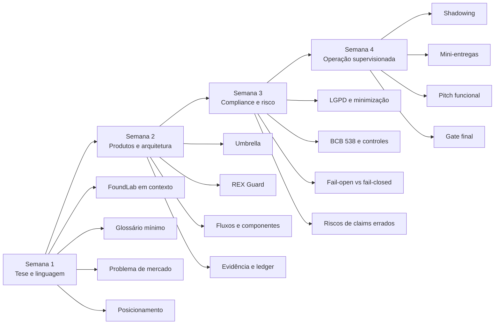
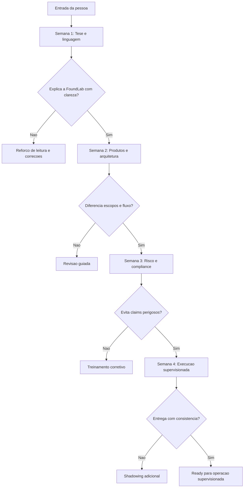

# FoundLab Onboarding Roadmap v1.0

**Tipo:** Institutional Learning Roadmap  
**Formato:** Markdown único, compatível com GitHub e Notion  
**Objetivo:** acelerar assimilação institucional, reduzir ruído conceitual e impedir erro operacional nas primeiras semanas.

---

## 1. Contexto

A FoundLab não pode onboardar gente nova como empresa SaaS comum. Aqui o erro não é só atraso, retrabalho ou desalinhamento comercial. O erro pode virar promessa regulatória errada, narrativa técnica mal formulada, venda mal encaixada, ou entendimento distorcido da arquitetura.

Por isso, este onboarding não foi desenhado como biblioteca de leitura passiva. Ele foi desenhado como **trilha de assimilação com sequência lógica, checkpoints e prova de entendimento**.

O objetivo é fazer qualquer novo integrante entender, em ordem:

1. o que a FoundLab constrói;
2. que problema estrutural ela resolve;
3. quais produtos e escopos existem;
4. quais invariantes arquiteturais e regulatórios não podem ser violados;
5. como atuar sem contaminar narrativa, operação ou execução.

---

## 2. Princípios do Onboarding

### 2.1 O que este onboarding precisa produzir

Ao final da trilha, a pessoa deve ser capaz de:

- explicar a FoundLab em 15 segundos, 1 minuto e 5 minutos;
- diferenciar **FoundLab**, **Umbrella**, **REX Guard** e demais narrativas sem misturar escopo;
- entender o núcleo de **Zero-Persistence**, **evidência auditável** e **fail-closed**;
- atuar na própria função sem gerar ruído institucional;
- saber o que **pode**, **não pode** e **não deve prometer**.

### 2.2 O que este onboarding não é

- não é manual de RH;
- não é cultura corporativa genérica;
- não é curso profundo de cloud engineering;
- não é dump de whitepapers;
- não é ritual motivacional.

### 2.3 Regra central

**Ninguém entra para “representar” a FoundLab sem antes entender tese, escopo, limites e risco.**

---

## 3. Mapa Geral do Conhecimento

```mermaid
flowchart TB
    A[FoundLab Onboarding] --> B[Camada 1: Identidade e Tese]
    A --> C[Camada 2: Produtos e Escopos]
    A --> D[Camada 3: Arquitetura e Runtime]
    A --> E[Camada 4: Segurança e Compliance]
    A --> F[Camada 5: Operação por Função]
    A --> G[Camada 6: Provas de Assimilação]

    B --> B1[Quem somos]
    B --> B2[Qual problema resolvemos]
    B --> B3[Trust by Physics]
    B --> B4[Zero-Persistence]
    B --> B5[Confiança como infraestrutura]

    C --> C1[FoundLab]
    C --> C2[Umbrella]
    C --> C3[REX Guard]
    C --> C4[Posicionamento por contexto]
    C --> C5[Claims permitidos e proibidos]

    D --> D1[Fluxo operacional]
    D --> D2[DecisionID]
    D --> D3[Evidence Packet]
    D --> D4[Ledger WORM]
    D --> D5[Fail-Closed]

    E --> E1[LGPD]
    E --> E2[BCB 538]
    E --> E3[EU AI Act]
    E --> E4[Minimização]
    E --> E5[Controles verificáveis]

    F --> F1[Vendas]
    F --> F2[Parcerias]
    F --> F3[Produto]
    F --> F4[Engenharia]
    F --> F5[Executivo]

    G --> G1[Pitch de 60s]
    G --> G2[Simulação de caso]
    G --> G3[Checklist de readiness]
    G --> G4[Avaliação oral]
```



---

## 4. Sequência de Aprendizagem — 30 Dias



---

## 5. Estrutura por Camada

### Camada 1 — Identidade e Tese

#### Objetivo
Dar ao novo integrante a moldura correta antes de qualquer detalhe técnico.

#### O que precisa entender

- FoundLab não é software comum; é infraestrutura de confiança auditável;
- o problema central não é “usar IA”, mas **operar IA e decisões críticas com prova, controle e responsabilização**;
- a empresa existe para transformar confiança, evidência e conformidade em componentes programáveis;
- **Trust by Physics** significa trocar confiança implícita por verificabilidade operacional e criptográfica;
- **Zero-Persistence** não é slogan solto; é princípio arquitetural com escopo bem definido.

#### Resultado esperado
A pessoa consegue responder:

- por que a FoundLab existe?
- o que muda no mundo quando essa camada existe?
- por que isso interessa para instituições reguladas?

---

### Camada 2 — Produtos e Escopos

#### Objetivo
Impedir mistura de narrativas, claims errados e confusão entre marca, tese e produto.

#### Núcleo

| Elemento | Definição operacional | Uso correto |
|---|---|---|
| **FoundLab** | empresa e tese institucional | narrativa corporativa, visão, arquitetura de confiança |
| **Umbrella** | plataforma institucional TradFi/B2B | documentos, parsing, validação, score explicável, evidência auditável |
| **REX Guard** | runtime governance layer / reverse proxy | governança de inferência, evidência criptográfica, zero-persistence operacional |
| **ATI** | camada de infraestrutura de confiança auditável | linguagem estratégica/institucional |

#### Regra crítica
Não misturar escopo institucional TradFi com terminologia desnecessária de outras teses quando a conversa exigir clareza comercial.

#### Resultado esperado
A pessoa consegue dizer:

- qual produto encaixa em qual dor;
- o que é wedge e o que é tese maior;
- o que pertence à marca e o que pertence ao runtime.

---

### Camada 3 — Arquitetura e Runtime

#### Objetivo
Gerar entendimento suficiente para a pessoa não falar bobagem técnica, mesmo que não seja engenheira.

#### Conceitos obrigatórios

- **DecisionID**: identificador único por decisão/execução;
- **Evidence Packet**: prova mínima da execução, sem depender do payload sensível;
- **Ledger WORM**: trilha imutável, append-only, preparada para auditoria;
- **policy snapshot**: contexto normativo/operacional usado na execução;
- **hash / assinatura / cadeia de integridade**: base de verificabilidade;
- **fail-closed**: na dúvida crítica, o sistema bloqueia e não segue;
- **evidência sem payload**: prova de que algo ocorreu, sem reter o conteúdo sensível em si.

#### O que a pessoa não pode confundir

- log ≠ evidência;
- armazenamento técnico ≠ retenção estratégica;
- prova criptográfica ≠ storytelling bonito;
- disponibilidade operacional ≠ permissividade;
- segurança declarada ≠ controle verificável.

#### Resultado esperado
A pessoa consegue explicar um fluxo simplificado:

1. entrada;
2. política/validação;
3. processamento;
4. decisão;
5. geração de evidência;
6. registro auditável;
7. comportamento de contenção quando algo crítico falha.

---

### Camada 4 — Segurança, Risco e Compliance

#### Objetivo
Fazer com que o novo integrante fale com precisão e nunca “venda milagre regulatório”.

#### Eixos mínimos

- **LGPD**: minimização, necessidade, eliminação, controle de exposição;
- **BCB 538**: controles, rastreabilidade, responsabilidade operacional e cibernética;
- **EU AI Act**: governança, logging aplicável, rastreabilidade e accountability em sistemas relevantes;
- **Zero Trust**: identidade, privilégio mínimo, segmentação e validação explícita;
- **Fail-Closed**: se componente crítico falha, não se finge normalidade.

#### Claim institucional correto
A FoundLab **não “resolve tudo”**. A FoundLab **mitiga risco e eleva capacidade de controle por mecanismos verificáveis**.

#### Claim institucional proibido

- “não existe risco”;
- “a IA fica automaticamente compliant”;
- “não armazenamos nada em hipótese alguma” sem explicar escopo;
- “o sistema nunca falha”;
- “a arquitetura substitui governança humana”.

#### Resultado esperado
A pessoa sabe onde termina tecnologia e onde começa governança institucional.

---

### Camada 5 — Operação por Função

#### Objetivo
Adaptar o conhecimento comum ao trabalho real que a pessoa vai executar.

##### Trilha Vendas

Precisa dominar:

- dor do cliente em linguagem de negócio;
- tradução de arquitetura em valor operacional;
- claims permitidos e claims proibidos;
- diferenciação contra concorrência que só entrega “IA com dashboard”;
- como vender redução de risco sem cair em conversa mole.

Entregável:

- pitch de 60s;
- pitch de 5min;
- FAQ de objeções;
- lista de frases proibidas.

##### Trilha Parcerias

Precisa dominar:

- leitura institucional da tese;
- posicionamento por ecossistema (cloud, consultoria, auditoria, bancos, integradores);
- o que é complementar e o que cria dependência ruim;
- como enquadrar FoundLab como camada crítica, não feature periférica.

Entregável:

- mapa de parceiros por função;
- tese de encaixe;
- critérios de NO-GO.

##### Trilha Produto

Precisa dominar:

- escopo de cada solução;
- entradas, saídas e invariantes;
- critérios de aceite;
- rastreabilidade de decisão e evidência;
- o que é requisito funcional versus requisito de controle.

Entregável:

- mini-PRD;
- matriz de claims;
- checklist de boundary conditions.

##### Trilha Engenharia

Precisa dominar:

- componentes críticos do runtime;
- failure modes;
- comportamento fail-closed;
- trilha de evidência;
- controles de segurança, chaves, observabilidade e ledger.

Entregável:

- walkthrough de arquitetura;
- mapa de dependências;
- checklist de invariantes;
- simulação de incidente.

##### Trilha Executiva

Precisa dominar:

- tese institucional;
- moat técnico-regulatório;
- posicionamento comercial;
- onde há risco real versus narrativa aspiracional;
- como explicar FoundLab para board, regulador, parceiro e investidor.

Entregável:

- memo executivo de 1 página;
- versão oral de 3 minutos;
- lista de riscos estratégicos.

---

## 6. Roadmap Semanal Detalhado

### Semana 1 — Linguagem, tese e posicionamento

#### Meta
Fazer a pessoa sair do modo “ouvi falar” e entrar no modo “sei explicar o núcleo”.

#### Conteúdo

- origem e missão da FoundLab;
- problema estrutural do mercado;
- o que significa confiança auditável;
- introdução a Zero-Persistence;
- glossário mínimo;
- diferenciação entre empresa, tese e produto.

#### Leitura / estudo sugerido

- manifesto institucional / one-pager;
- deck de tese;
- glossário FoundLab;
- FAQ de posicionamento.

#### Exercício

- explicar a FoundLab em 15 segundos;
- explicar a FoundLab em 1 minuto;
- listar 5 erros de interpretação comuns.

#### Gate
A pessoa só avança se conseguir explicar a empresa sem colapsar tudo em “IA para compliance”.

---

### Semana 2 — Produtos, fluxo e arquitetura

#### Meta
Entender como a proposta vira sistema.

#### Conteúdo

- Umbrella: fluxo operacional e casos de uso;
- REX Guard: governança de inferência e evidência;
- fluxo de decisão com DecisionID;
- ledger e prova auditável;
- fail-closed e contenção.

#### Exercício

- desenhar o fluxo simplificado do produto relevante para sua função;
- explicar o que persiste e o que não persiste;
- apontar 3 pontos de risco operacional.

#### Gate
A pessoa só avança se diferenciar corretamente **processamento**, **evidência** e **retenção**.

---

### Semana 3 — Risco, segurança e compliance

#### Meta
Impedir linguagem perigosa e claims irresponsáveis.

#### Conteúdo

- minimização e necessidade;
- controle e auditabilidade;
- trilhas de evidência;
- responsabilidade operacional;
- diferença entre “mitigar” e “resolver”.

#### Exercício

- revisar 10 claims comerciais e marcar quais são aceitáveis;
- simular resposta a uma objeção regulatória;
- explicar fail-open vs fail-closed para não técnico.

#### Gate
A pessoa só avança se demonstrar que sabe onde mora o risco institucional da narrativa.

---

### Semana 4 — Execução supervisionada

#### Meta
Transformar assimilação em comportamento operacional.

#### Conteúdo

- shadowing com alguém da área;
- execução de uma mini-entrega;
- apresentação final;
- feedback corretivo.

#### Exercício

- montar pitch, memo, walkthrough ou mini-especificação conforme função;
- responder perguntas críticas;
- defender escopo e limites da solução.

#### Gate final
A pessoa precisa mostrar capacidade de atuar com supervisão sem gerar ruído, promessa errada ou simplificação burra.

---

## 7. Glossário Essencial FoundLab

| Termo | Definição de trabalho |
|---|---|
| **Auditable Trust Infrastructure** | camada de infraestrutura que transforma controle, evidência e auditabilidade em componentes operacionais |
| **Zero-Persistence** | princípio arquitetural de minimizar retenção de dados sensíveis e operar com descarte/controlos adequados, dentro de escopo definido |
| **DecisionID** | identificador único associado a uma decisão, execução ou inferência |
| **Evidence Packet** | conjunto mínimo de evidências necessário para prova e auditoria sem depender do payload sensível |
| **Ledger WORM** | registro imutável, append-only, preparado para trilha de auditoria |
| **Fail-Closed** | comportamento seguro em que o sistema bloqueia/aborta diante de falha crítica ao invés de seguir inseguro |
| **Policy Snapshot** | fotografia lógica das regras, políticas e contexto relevantes para uma decisão |
| **Runtime Governance** | controles exercidos em tempo de execução sobre o comportamento do sistema |
| **Auditability** | capacidade de demonstrar, verificar e reconstruir logicamente a trilha de decisão por evidência confiável |
| **Minimização** | princípio de tratar apenas os dados estritamente necessários |
| **Containment** | mecanismos de limitação de impacto quando algo sai do previsto |

---

## 8. Claims Permitidos vs Claims Proibidos

### Permitidos

- “A FoundLab entrega mecanismos auditáveis de controle e evidência.”
- “A arquitetura foi desenhada para minimizar retenção sensível e elevar verificabilidade.”
- “O sistema privilegia contenção e fail-closed diante de falhas críticas.”
- “A proposta é transformar confiança em infraestrutura operacional verificável.”
- “A solução foi pensada para ambientes regulados que exigem trilha de decisão e responsabilidade.”

### Proibidos

- “Estamos 100% blindados contra qualquer risco.”
- “Não existe armazenamento de nada nunca em hipótese alguma.”
- “A arquitetura resolve compliance automaticamente.”
- “Basta plugar e o problema regulatório desaparece.”
- “A governança humana deixa de ser necessária.”

---

## 9. Matriz de Maturidade do Novo Integrante

| Nível | Estado | Sinal esperado |
|---|---|---|
| **N0** | Contato inicial | conhece nomes, mas mistura tudo |
| **N1** | Compreensão básica | explica tese sem precisão operacional |
| **N2** | Compreensão funcional | diferencia produtos, escopos e conceitos principais |
| **N3** | Operação supervisionada | executa na área com baixo ruído e boa disciplina narrativa |
| **N4** | Representação confiável | consegue falar e agir em nome da tese com segurança suficiente |

---

## 10. Checklist de Readiness

### Checklist comum a qualquer função

- [ ] Consegue explicar a FoundLab em 15 segundos, 1 minuto e 5 minutos
- [ ] Diferencia empresa, tese, produto e runtime
- [ ] Entende Zero-Persistence sem exagerar claim
- [ ] Sabe o que é evidência auditável
- [ ] Entende por que fail-closed existe
- [ ] Não mistura log com prova
- [ ] Não vende “compliance automática”
- [ ] Sabe o que pode e o que não pode prometer

### Checklist específico para vendas/parcerias

- [ ] Consegue traduzir arquitetura em valor de negócio
- [ ] Sabe responder objeções sem inventar detalhe técnico
- [ ] Não colapsa a empresa em buzzword
- [ ] Identifica quando uma conversa é NO-GO

### Checklist específico para engenharia/produto

- [ ] Entende o fluxo end-to-end
- [ ] Sabe apontar componentes críticos
- [ ] Sabe descrever failure modes básicos
- [ ] Sabe explicar o racional de evidência e contenção

### Checklist específico para executivo

- [ ] Consegue defender tese, moat e limites
- [ ] Sabe separar narrativa aspiracional de estado real
- [ ] Consegue apresentar riscos sem parecer improviso

---

## 11. Diagrama de Gate de Evolução



---

## 12. Plano de Implementação Interna

### Versão mínima viável

Implementar em 5 ativos:

1. este documento `.md`;
2. glossário canônico;
3. deck/one-pager de leitura base;
4. checklist de claims permitidos/proibidos;
5. formulário simples de avaliação por função.

### Versão madura

Adicionar:

- trilha por cargo com materiais obrigatórios;
- provas rápidas por semana;
- banco de objeções reais;
- biblioteca de casos reais da FoundLab;
- rubric de avaliação institucional.

---

## 13. Output Contract

```json
{
  "document_name": "foundlab_onboarding_roadmap_v1",
  "goal": "form new people without narrative distortion or operational risk",
  "duration_days": 30,
  "core_layers": [
    "identity_and_thesis",
    "products_and_scope",
    "architecture_and_runtime",
    "security_and_compliance",
    "role_based_operation",
    "assimilation_proofs"
  ],
  "required_outputs": [
    "15s_pitch",
    "1min_pitch",
    "5min_pitch",
    "scope_differentiation",
    "claims_review",
    "role_specific_delivery"
  ],
  "gates": [
    "clarity_of_thesis",
    "scope_accuracy",
    "compliance_language_discipline",
    "supervised_execution_readiness"
  ],
  "success_criteria": {
    "can_explain_company": true,
    "can_differentiate_products": true,
    "can_avoid_dangerous_claims": true,
    "can_operate_under_supervision": true
  }
}
```

---

## 14. Riscos e Mitigações

### Risco 1 — onboarding virar dump de tese
**Mitigação:** toda semana termina com exercício, gate e output verificável.

### Risco 2 — pessoa decorar palavras e não entender arquitetura
**Mitigação:** exigir explicação oral + simulação de caso.

### Risco 3 — mistura de escopos e narrativas
**Mitigação:** matriz explícita de diferenciação já na semana 1.

### Risco 4 — claims perigosos em contexto comercial
**Mitigação:** treinamento obrigatório com frases proibidas e correção de linguagem.

### Risco 5 — densidade excessiva no início
**Mitigação:** sequência por camadas, não despejo de documentação.

---

## 15. Próximo Passo Recomendado

Transformar este roadmap em um **kit operacional de onboarding**, composto por:

1. `README-Onboarding.md` (este arquivo);
2. `Glossario-FoundLab.md`;
3. `Claims-Permitidos-vs-Proibidos.md`;
4. `Trilha-Vendas.md`;
5. `Trilha-Engenharia.md`;
6. `Rubrica-de-Avaliacao.md`.

Quando isso existir, o onboarding deixa de ser conversa solta e vira sistema.
